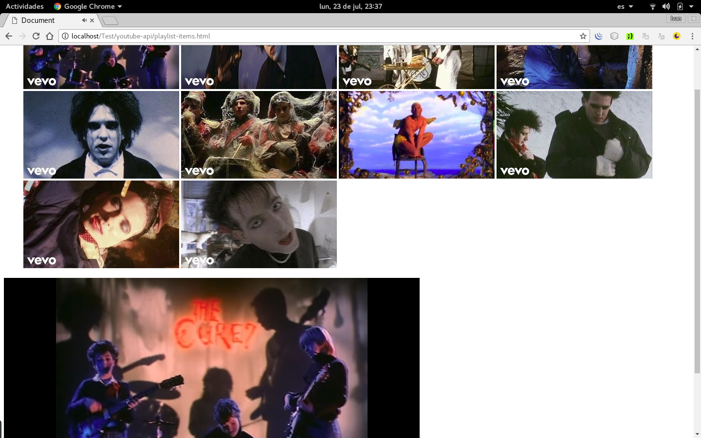

# youtube-public-api #

Recursos publicos mediante API KEY de Youtube
Agradecimientos : The Cure - https://bit.ly/2LCJF42

### 1. Playlist Item - Listado de Videos de un Playlist ###

    const API_KEY = ''; // https://console.cloud.google.com/projectcreate
    const PLAYLIST_ID = 'RDEMLUGe1lzhB7MnQLLEheFTww'; // Playlist de la banda The Cure
    const PART = 'contentDetails,snippet'; // tipo de componente en el response
    const MAX_RESULTS = 10; // cantidad de videos

